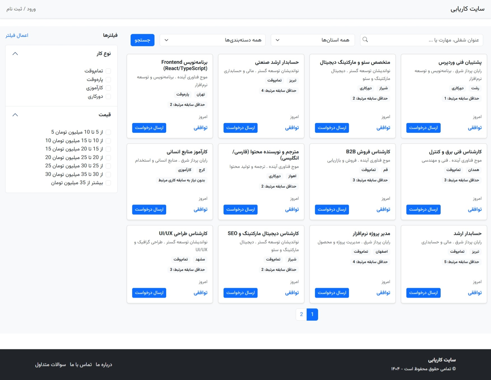
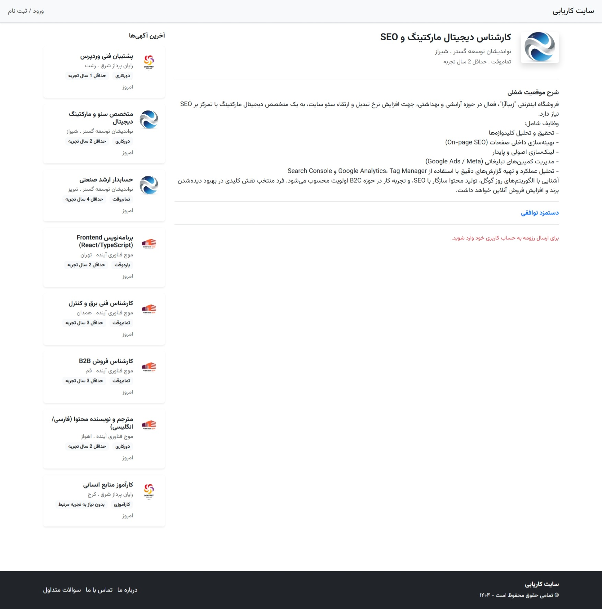
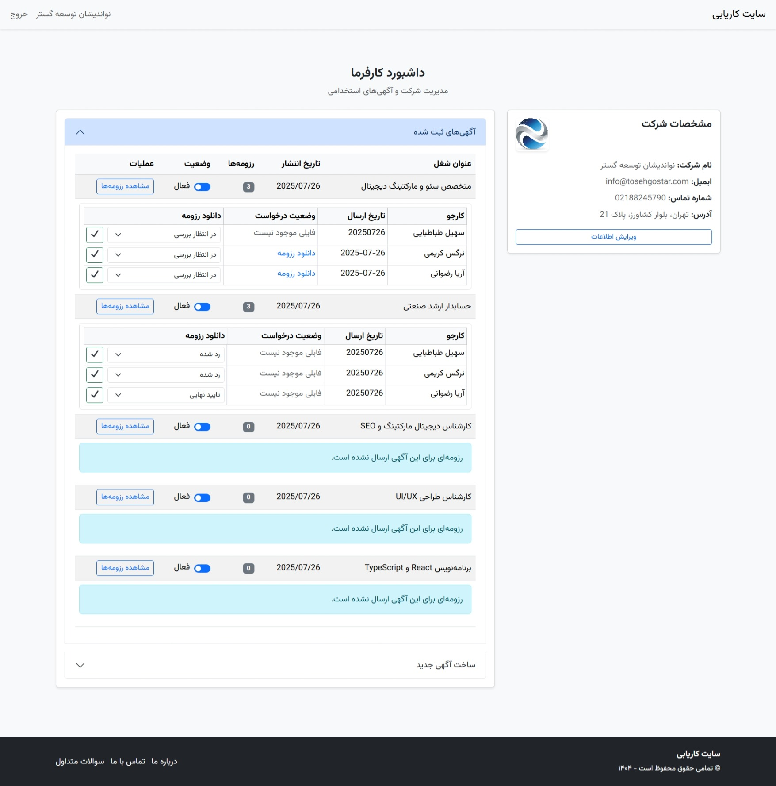
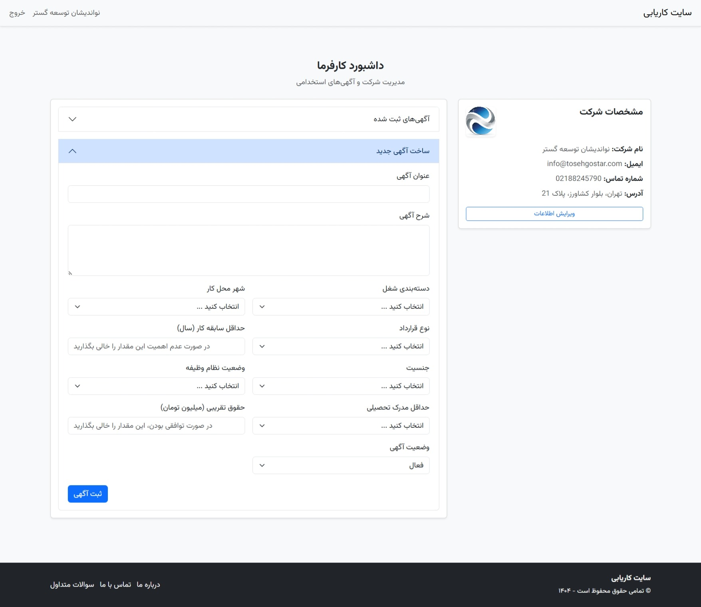
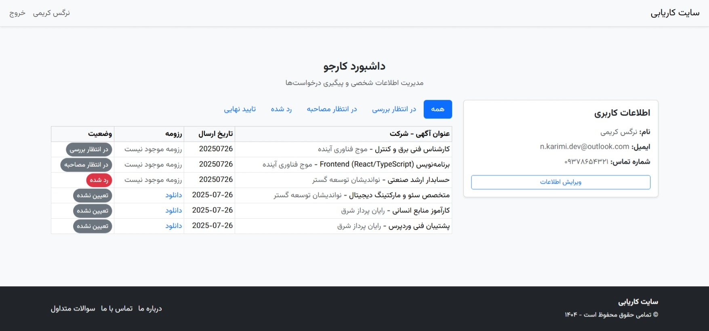
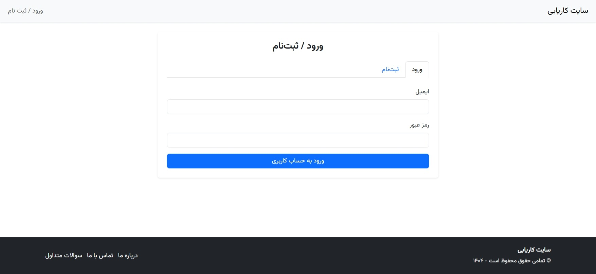
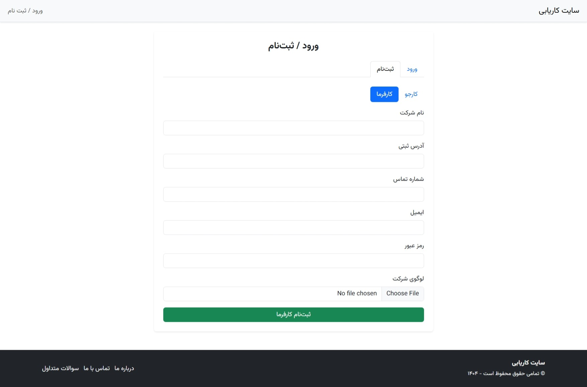
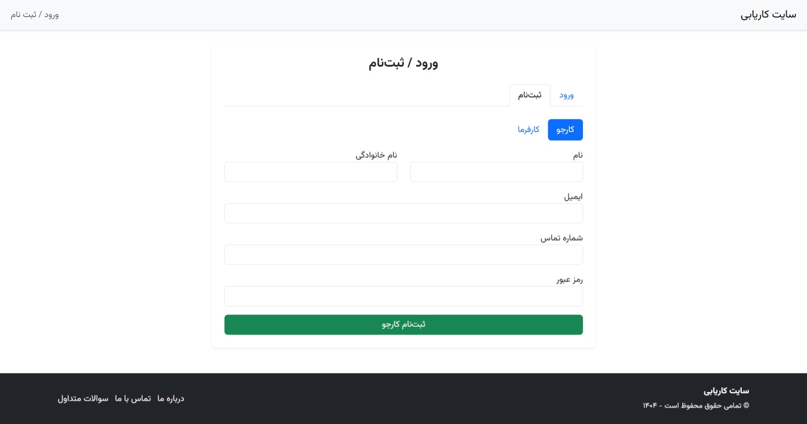

# JobBoard – Custom WordPress Job Board Theme

A fully custom, responsive WordPress theme built for a job board website with separate dashboards for employers and job seekers. It is developed with minimal use of plugins (ACF only) and uses Bootstrap components for styling.

## 🧩 Features

- Custom Post Types:
  - **Job**: for job advertisements.
  - **Job Application**: for applications submitted by job seekers.
- Custom User Roles:
  - **Employer**: Can create, manage, and view job posts and job applications.
  - **Jobseeker**: Can browse jobs and submit applications.
- Frontend login/register page with tabs for employer and jobseeker.
- Dashboard pages for each role with restricted access.
- Resume upload as PDF and management for each job post.
- Responsive design using Bootstrap 5.

---

## 🏗️ Folder Structure
Job-Board-Theme/
│
├── assets/                           # Static assets like stylesheets, scripts, images, fonts
│   ├── bootsrap/                     # Bootstrap files (CSS, JS, optionally customized)
│   ├── css/                          # Custom theme stylesheets
│   ├── fonts/                        # Web fonts used by the theme
│   ├── js/                           # JavaScript files (custom functionality, UI interactions)
│   └── photo/                        # Images used in UI (e.g. icons, illustrations)
│
├── template-parts/                  # Reusable UI components and partial templates
│   └── job-filter-form.php          # Job filtering form used on job listing pages
│
├── inc/                             # Included PHP files for custom functions and logic
│   └── ajax/                        # AJAX handler scripts
│       ├── submit-job-application.php   # Handles resume submissions by jobseekers
│       └── update-employer-profile.php # Handles employer profile updates
│
├── footer.php                       # Theme footer template
├── front-page.php                   # Custom front page template (job listings + filters)
├── functions.php                    # Core functions, CPTs, roles, capabilities, ACF support
├── header.php                       # Theme header template (navigation, meta, etc.)
├── index.php                        # Fallback/main template or job archive template
├── page-employer-dashboard.php     # Employer dashboard page (view jobs, manage applications)
├── page-jobseeker-dashboard.php    # Jobseeker dashboard page (view submissions, edit profile)
├── page-login.php                   # Custom login/register page (with tabs for employer/jobseeker)
├── single-job.php                   # Single job ad detail view (job description + apply form)
├── screenshot.jpeg                  # Theme screenshot shown in WordPress Appearance section
├── style.css                        # Main stylesheet + theme metadata (name, version, author)
└── README.md                        # Project documentation and developer notes

---

## 📄 Custom Fields (via ACF)

### `Job` post type

- `job_category` – Select
- `job_location` – Select (City)
- `job_type` – Select (Contract type)
- `job_experience` – Number
- `gender` – Select
- `military_status` – Select
- `min_education` – Select
- `job_salary` – Number (in million Toman)
- `job_status` – Select (Active/Inactive)
- `job_author` – Text (employer name)

### `Job Application` post type

- `job_id` – Number (related job post ID)
- `jobseeker_id` – Number (user ID of applicant)
- `resume_file` – File (PDF)
- `status` – Select (e.g. New, Interview, Rejected)
- `employer_note` – Textarea
- `submission_date` – Date

### Employer Profile (user meta)

- `contact_number` – Text
- `company_address` – Text
- `company_logo` – Image

### Jobseeker Profile (user meta)

- `contact_number` – Text

---

## 🔐 Access Control

- Employers can only manage their own job posts and view job applications related to them.
- Jobseekers can only apply for jobs and view their own applications.
- Admins have full access to both post types and all user data.

---

## 📸 Theme Screenshots

### Homepage View  

### Job Details Page  

### Employer Dashboard  

### Jobseekr Dashboard

### Login Page  

### Sign Up Page  

---

## 🧪 Requirements

- WordPress 6.0+
- ACF (Advanced Custom Fields) plugin
- PHP 7.4+

---

## 📌 Notes

- No default access to `/wp-admin` for employers and jobseekers. They are redirected to the frontend login and dashboard pages.
- All fields are created using **Advanced Custom Fields** (ACF).
- Minimal plugin usage and clean, readable code.

---

## 🔧 Setup Instructions

1. Install and activate the theme.
2. Install and activate **ACF**.
3. Create the necessary custom fields using ACF (as listed above).
4. Create pages and assign appropriate templates:
   - Login/Register Page → `page-login.php`
   - Employer Dashboard → `page-dashboard-employer.php`
   - Jobseeker Dashboard → `page-dashboard-jobseeker.php`
5. Add `screenshot.png` for theme preview.

---

## 👨‍💻 Developer

This theme is developed as a custom solution for a job board site with minimal reliance on plugins, clean code structure, and full role-based access control.